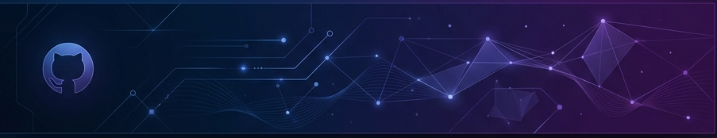

  

  

---

## 🚀 About Me

 

> *"Code is like humor. When you have to explain it, it's bad."* - Cory House

### 👨‍💻 **Who Am I?**

**Jalal Eddine** - A passionate full-stack developer dedicated to creating digital experiences that matter. Based anywhere in the world, I'm always ready to collaborate on exciting projects both remotely and on-site.

#### 🎯 **My Expertise**
- **Languages**: JavaScript, TypeScript, Python, Java, C++
- **Frameworks**: React, Vue, Angular, Next.js, Express, Django
- **Databases**: MongoDB, PostgreSQL, MySQL, Redis
- **Cloud**: AWS, Azure, Google Cloud, Docker, Kubernetes

#### 🌟 **My Interests**
- 🎯 **Full-Stack Development** - Building complete solutions from front to back
- 📱 **Mobile App Development** - Creating engaging mobile experiences
- ☁️ **Cloud Architecture** - Designing scalable cloud solutions
- 🤖 **AI/ML Integration** - Incorporating AI into web applications
- 🔒 **Cybersecurity** - Building secure and robust applications
- 📊 **Data Visualization** - Making data meaningful and accessible

#### 💼 **My Work Style**
- **Collaborative & Detail-oriented** - I thrive in team environments
- **Always curious, always growing** - Continuous learning is my passion
- **Problem-solving with creativity** - Finding innovative solutions to complex challenges
- **Build it right, build it once** - My motto for quality development

#### 🎮 **Fun Facts About Me**
- ☕ I run on coffee and code
- 🧩 Can solve Rubik's cube in under 2 minutes
- 🎮 Love gaming and game development
- 📚 Read tech blogs during breakfast
- 🌱 Passionate about sustainable tech

#### 🚀 **Current Mission**
Building scalable applications that make a difference and open to new opportunities and collaborations!

### 🔹 My Core Values

  <table>
    <tr>
      <td align="center" width="50%">
        
         <b>Over-Delivering</b>
         Always striving to deliver beyond expectations.
      </td>
      <td align="center" width="50%">
        
         <b>Honesty & Transparency</b>
         Treating every project as if it were my own.
      </td>
    </tr>
    <tr>
      <td align="center" width="50%">
        
         <b>Responsiveness & Consulting</b>
         Open communication and technology guidance.
      </td>
      <td align="center" width="50%">
        
         <b>Kindness</b>
         Respect and collaboration in every relationship.
      </td>
    </tr>
  </table>

### 💡 **My Development Philosophy**

> *"The best code is not just functional, but also maintainable, scalable, and a joy to work with."*

- 🎨 **Clean Code**: Writing code that tells a story
- 🚀 **Performance First**: Optimizing for speed and efficiency  
- 🔒 **Security Minded**: Building with security as a foundation
- 📱 **User-Centric**: Always thinking about the end user
- 🌱 **Continuous Learning**: Staying updated with latest trends

---

## 📺 Featured Video

  
   
  <b>🎬 Practical Wisdom: 12 Quotes to Inspire Personal Growth and Success</b>
   
  Check out my latest insights on SkillVerse!

   
  

---

## 🛠️ Tech Stack

### 🔹 Core Development Stack

#### Languages & Frameworks

#### UI & Styling

#### State & Data Orchestration

### 🔹 Infrastructure & Data

#### Databases & Cloud

#### DevOps & Deployment

#### Testing & Quality

### 🔹 CMS & Design

#### CMS & LMS

#### Design Tools

---

## 📊 GitHub Stats

  

  

---

## 🏆 GitHub Trophies

  

---

## 🎯 Current Focus

- 🔭 **Currently Working On**: Building scalable web applications with modern tech stack
- 🌱 **Currently Learning**: Advanced cloud architecture and DevOps practices
- 👯 **Looking to Collaborate**: Open source projects and innovative web applications
- 🤔 **Looking for Help With**: Machine Learning integration in web applications
- 💬 **Ask Me About**: Full-stack development, web technologies, and career advice
- 📫 **How to Reach Me**: [Your Email] | [LinkedIn](https://linkedin.com/in/your-profile) | [Portfolio](https://your-portfolio.com)
- ⚡ **Fun Fact**: I can solve a Rubik's cube in under 2 minutes! 🧩

---

## 🚀 Let's Connect!

  
  
  
  

---

  

  

